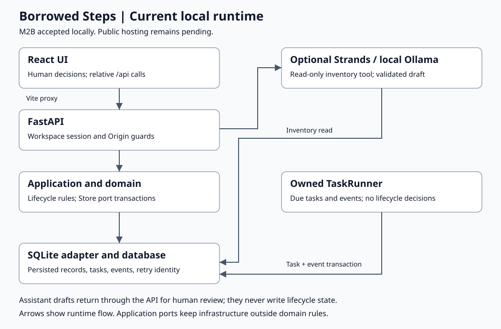

# Current local architecture

[Mermaid source](current_local_architecture.mmd). Both diagrams describe runtime flow, not Python import dependencies. Public hosting is pending; see [M3 direction](../../docs/M3_HOSTED_DIRECTION.md).

The browser calls relative `/api` routes through Vite's local proxy. FastAPI checks workspace sessions and mutation origins. The browser prevents overlapping mutations; backend transactions, version checks and idempotency enforce persisted consistency.

Domain rules are independent of HTTP, model and database frameworks. Application use cases depend on domain types and ports. HTTP and infrastructure adapters supply the concrete implementations; runtime composition wires the SQLite adapter to the store port.

Human-confirmed lifecycle operations write equipment, requests, loans and audit records atomically. Inspection supports AVAILABLE, REPAIR and QUARANTINED. The database constrains competing active allocations.

The optional Strands/Ollama intake adapter executes a read-only inventory tool, then extracts and validates structured output. It returns an advisory draft with provenance; it has no lifecycle write tools. Human review and separate form submission are required. It is disabled by default.

FastAPI lifespan owns a background TaskRunner thread with bounded shutdown. Due processing updates coordination tasks and appends loan due events transactionally; it never performs pickup, return or inspection for the volunteer. It runs without an open browser while the backend process is running. Notifications are in-app only.

SQLite persists workspace records, tasks, events and idempotency state on disk. This local architecture requires a running backend process and is not a serverless deployment design.
